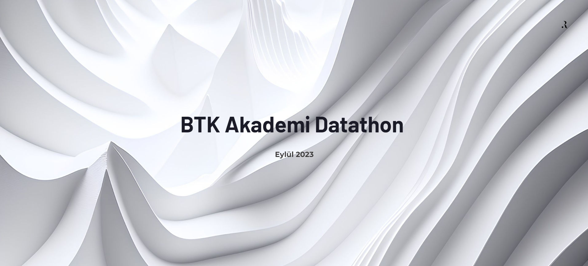

<h1 align="center">BTK Akademi Datathon 2023</h1>

<b>Türkçe Açıklama İçin Tıklayınız</b>

  
Bu GitHub deposu, 2023 BTK Datathon yarışmasına katılarak geliştirilen Alışveriş Müşteri Sınıflandırma projesini içerir.

## Proje Amaçları

Bu yarışmanın temel amacı, bir alışveriş firmasının müşterilerinin hangi sınıflara ait olduğunu tahmin etmek ve bu sınıflar için pazarlama stratejileri geliştirmektir.

## Proje Sunumu

- Online Link: [https://gamma.app/public/Original-BTK-ah8u9n3rgb5h95c](https://gamma.app/public/Original-BTK-ah8u9n3rgb5h95c)
- Sunuma ayrıca `./Presentation/Sunum.pdf` kısmından da ulaşabilirsiniz.

## Veri Seti

Çalışılan veri seti aşağıdaki özellikleri içerir:
- Cinsiyet
- Yaş Grubu
- Medeni Durum
- Eğitim Düzeyi
- İstihdam Durumu
- Yıllık Ortalama Gelir
- Yaşadığı Şehir
- En Çok İlgilendiği Ürün Grubu
- Yıllık Ortalama Satın Alım Miktarı
- Yıllık Ortalama Sipariş Verilen Ürün Adedi
- Eğitime Devam Etme Durumu
- Yıllık Ortalama Sepete Atılan Ürün Adedi
- Öbek İsmi (Tahmin edilecek olan etiket)

## Çözüm Yaklaşımı

Proje süresince aşağıdaki adımlar takip edildi:
1. Keşifsel veri analizi
2. İlişkisel veri analizi
3. Kümeleme analizi
4. Makine öğrenmesi algoritmaları ile en iyi modelin belirlenmesi
5. Feature engineering
6. Hiperparametre ayarı ile en iyi modelin belirlenmesi
7. Çeşitli metriklerle başarı testleri

Random Forest algoritması, çoklu sınıf problemlerinde etkili olması, iyi performans göstermesi, hızlı öğrenmesi, çeşitli hiperparametre seçeneklerine sahip olması, overfittinge karşı dayanıklı olması ve otomatik özellik seçimi yapması nedeniyle tercih edildi.

## Sonuçlar

Yarışmada ilk 10'a kalarak final sunumlarına hak kazandım, ancak ilk 3'te bulunamadım.

## İletişim

Proje hakkında geri bildirim veya sorularınız için lütfen iletişime geçin: 
- E-posta: [ramazan.erduran@outlook.com.tr](mailto:ramazan.erduran@outlook.com.tr)
- LinkedIn: [ramazan-erduran](https:www.linkedin.com/in/ramazan-erduran)

---

This GitHub repository contains the Shopping Customer Classification project developed for the 2023 BTK Datathon.

## Project Objectives

The main goal of this competition is to predict which classes customers of a shopping company belong to and to develop marketing strategies for these classes.

## Project's Presentation

- Online Link: [https://gamma.app/public/Original-BTK-ah8u9n3rgb5h95c](https://gamma.app/public/Original-BTK-ah8u9n3rgb5h95c)
- You can reach the presentation at `./Presentation/Sunum.pdf`

## Data Set

The dataset used in the project includes the following features:
- Gender
- Age Group
- Marital Status
- Education Level
- Employment Status
- Annual Average Income
- City of Residence
- Most Interested Product Group
- Annual Average Purchase Amount
- Annual Average Ordered Product Count
- Education Continuation Status
- Annual Average Products Added to Cart
- Cluster Name (the label to be predicted)

## Solution Approach

Throughout the project, the following steps were followed:
1. Exploratory data analysis
2. Relational data analysis
3. Clustering analysis
4. Determining the best model with machine learning algorithms
5. Feature engineering
6. Determining the best model with hyperparameter tuning
7. Performance testing with various metrics

The Random Forest algorithm was chosen due to its effectiveness in multi-class problems, good performance, fast learning, various hyperparameter options, resistance to overfitting, and automatic feature selection.

## Results

I made it to the top 10 in the competition and qualified for the final presentations, but I didn't make it to the top 3.

## Contact

For feedback or questions about the project, please feel free to contact me at:
- Email: [ramazan.erduran@outlook.com.tr](mailto:ramazan.erduran@outlook.com.tr)
- LinkedIn: [ramazan-erduran](https://www.linkedin.com/in/ramazan-erduran)
